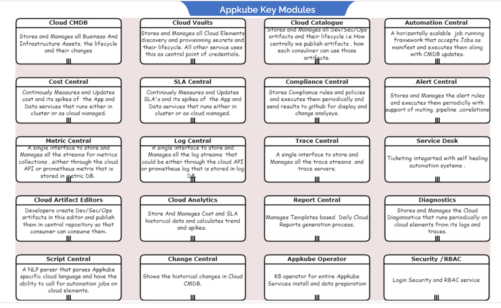

- [Introduction](#introduction)
- [Key-Modules-and-UseCases](#key-modules-and-usecases)
# Introduction
This document will detail about Appkube roadmap and releases.

Synectiks Appkube is a SRE platform that primarily focuses on following :

- Manage distributed microservices cost & Quality (container & server less) in multicloud hybrid environment
- Deliver reusable common App Blocks to write enterprise products with reduced coding effort
- Deliver DevSecOps tooling to write cloud native products

It helps customer who is devoloping products in cloudnative environment as follows:

- Reduced Operation Management time & Effort @50%
- Imporves product SLE's by 30%
- Reduce Cloud Capex by 25%
- Reduce Development Effort by 50%

## Key-Modules-and-UseCases

<table><tr><th valign="top">Module</td><th valign="top">Use Cases</td><th valign="top">Description</td></tr>
<tr><td valign="top">Cloud CMDB</td><td valign="top"></td><td valign="top"></td></tr>
<tr><td rowspan="23" valign="top"></td><td valign="top">Cloud Asset Discovery</td><td valign="top"></td></tr>
<tr></td><td valign="top">Cloud Asset to Business Manual Association</td><td valign="top"></td></tr>
<tr></td><td valign="top">Environment Wise Infra View</td><td valign="top"></td></tr>
<tr></td><td valign="top">Environment Wise Services View</td><td valign="top"></td></tr>
<tr></td><td valign="top">Environment Wise Application View</td><td valign="top"></td></tr>
<tr></td><td valign="top">Environment Wise Alerts View</td><td valign="top"></td></tr>
<tr></td><td valign="top">Environment Wise Threats/Compliance View</td><td valign="top"></td></tr>
<tr></td><td valign="top">Environment Wise Billing View</td><td valign="top"></td></tr>
<tr></td><td valign="top">Product wise Cost Explorer</td><td valign="top"></td></tr>
<tr></td><td valign="top">Product wise Services SLA Explorer</td><td valign="top"></td></tr>
<tr></td><td valign="top">Filters in Asset Home Page</td><td valign="top"></td></tr>
<tr></td><td valign="top">Add department / product / Env Manually</td><td valign="top"></td></tr>
<tr></td><td valign="top">Unused Assets / Manually Associated Assets/ Auto discovered Assets</td><td valign="top"></td></tr>
<tr></td><td valign="top">Set logs for Element</td><td valign="top"></td></tr>
<tr></td><td valign="top">Set Trace for Element</td><td valign="top"></td></tr>
<tr></td><td valign="top">Enable Monitoring for Cloud Elements</td><td valign="top"></td></tr>
<tr></td><td valign="top">Enable Alerts for Cloud Elements</td><td valign="top"></td></tr>
<tr></td><td valign="top">Filter Orphaned Elements - No logs / No Trace/ No monitoring</td><td valign="top"></td></tr>
<tr></td><td valign="top">Filter Non-productive Assets / Productive Assets</td><td valign="top"></td></tr>
<tr></td><td valign="top">Filter Non-Secure / Non-Compliant Assets</td><td valign="top"></td></tr>
<tr></td><td valign="top">Add product deployment JSON in GitHub from automation central and the corresponding details are imported in CMDB.</td><td valign="top"></td></tr>
<tr></td><td valign="top">Cloud Services Mesh</td><td valign="top"></td></tr>
<tr></td><td valign="top">Data Mesh Support</td><td valign="top"></td></tr>
<tr><td valign="top"></td><td valign="top">Service Topology and Its drilldown</td><td valign="top"></td></tr>
<tr><td valign="top">Automation Central</td><td valign="top"></td><td valign="top"></td></tr>
<tr><td rowspan="13" valign="top"></td><td valign="top">Add landing Zone</td><td valign="top"></td></tr>
<tr></td><td valign="top">Add product enclave</td><td valign="top"></td></tr>
<tr></td><td valign="top">Add cluster</td><td valign="top"></td></tr>
<tr></td><td valign="top">Add Gateway</td><td valign="top"></td></tr>
<tr></td><td valign="top">Add LB in product</td><td valign="top"></td></tr>
<tr></td><td valign="top">Add product in product enclave</td><td valign="top"></td></tr>
<tr></td><td valign="top">Add Business Service in a product</td><td valign="top"></td></tr>
<tr></td><td valign="top">Add Common Service in a product</td><td valign="top"></td></tr>
<tr></td><td valign="top">Run Audits on Product</td><td valign="top"></td></tr>
<tr></td><td valign="top">Run Audits on Landing Zone</td><td valign="top"></td></tr>
<tr></td><td valign="top">Run Audits on Product Enclave</td><td valign="top"></td></tr>
<tr></td><td valign="top">Run Audits on Cluster</td><td valign="top"></td></tr>
<tr></td><td valign="top">Self Service Provisioning – Org / Business </td><td valign="top"></td></tr>
<tr><td valign="top">Security/RBAC </td><td valign="top"></td><td valign="top"></td></tr>
<tr><td valign="top"></td><td valign="top">
Add/Update/Delete

Users / Groups / Role / Transactions
</td><td valign="top"></td></tr>
<tr><td valign="top"></td><td valign="top">Add Configurable Authentication methods for users</td><td valign="top"></td></tr>
<tr><td valign="top"></td><td valign="top">Define RBAC for User/ Group / Roles </td><td valign="top"></td></tr>
<tr><td valign="top"></td><td valign="top">Integrate Vault for storing Authentication Details.</td><td valign="top"></td></tr>
<tr><td valign="top">Catalogue Management</td><td valign="top"></td><td valign="top"></td></tr>
<tr><td rowspan="3" valign="top"></td><td valign="top">View / Search Global Catalogue</td><td valign="top"></td></tr>
<tr></td><td valign="top">Manage artifact libraries</td><td valign="top"></td></tr>
<tr></td><td valign="top">Import Artifacts</td><td valign="top"></td></tr>
<tr><td valign="top">Preference Management</td><td valign="top"></td><td valign="top"></td></tr>
<tr><td rowspan="5" valign="top"></td><td valign="top">User / Group / Role Management</td><td valign="top"></td></tr>
<tr></td><td valign="top">Vault Integration</td><td valign="top"></td></tr>
<tr></td><td valign="top">Environment Specific Watcher / Jobs on /off</td><td valign="top"></td></tr>
<tr></td><td valign="top">SLA / Cost Update Periodicity</td><td valign="top"></td></tr>
<tr></td><td valign="top">Manage Metric / Log / Trace Databases</td><td valign="top"></td></tr>
<tr><td valign="top">Vault</td><td valign="top"></td><td valign="top"></td></tr>
<tr><td valign="top"></td><td valign="top">Store/ Retrieve Cloud Env Details in Vault</td><td valign="top"></td></tr>
<tr><td valign="top">Metric Central</td><td valign="top"></td><td valign="top"></td></tr>
<tr><td valign="top"></td><td valign="top">Get Metrics of Cloud Element directly with Vault</td><td valign="top"></td></tr>
<tr><td valign="top"></td><td valign="top">Get Metric of Cloud Element from Prometheus & Vault</td><td valign="top"></td></tr>
<tr><td valign="top"></td><td valign="top">Add Metric Database in K8 cluster</td><td valign="top"></td></tr>
<tr><td valign="top"></td><td valign="top">Provision Dynamic Prometheus Agents for Account / Cloud Elements</td><td valign="top"></td></tr>
<tr><td valign="top"></td><td valign="top">Manage Prometheus Pool of Agents (Add / update / Delete)</td><td valign="top"></td></tr>
<tr><td valign="top">Log Central</td><td valign="top"></td><td valign="top"></td></tr>
<tr><td valign="top"></td><td valign="top">Search Logs of Cloud Element directly with Vault</td><td valign="top"></td></tr>
<tr><td valign="top"></td><td valign="top">Search Logs of Cloud Element from Promtail / logdb & Vault</td><td valign="top"></td></tr>
<tr><td valign="top"></td><td valign="top">Add Logdb Database in K8 cluster</td><td valign="top"></td></tr>
<tr><td valign="top"></td><td valign="top">Provision Dynamic Prom tail log Agents for Account / Cloud Elements</td><td valign="top"></td></tr>
<tr><td valign="top"></td><td valign="top">Manage Prometheus Pool of Log Agents (Add / update / Delete)</td><td valign="top"></td></tr>
<tr><td valign="top">Trace Central</td><td valign="top"></td><td valign="top"></td></tr>
<tr><td valign="top"></td><td valign="top">Search Traces of Cloud Element directly with Vault & AWS XRAY</td><td valign="top"></td></tr>
<tr><td valign="top"></td><td valign="top">Search Logs of Cloud Element from TraceDb & Vault</td><td valign="top"></td></tr>
<tr><td valign="top"></td><td valign="top">Add Trace Db Database in K8 cluster</td><td valign="top"></td></tr>
<tr><td valign="top"></td><td valign="top">Set/ Configure Cloud Elements to pass its trace data</td><td valign="top"></td></tr>
<tr><td valign="top"></td><td valign="top"></td><td valign="top"></td></tr>
<tr><td valign="top">Cost Central</td><td valign="top"></td><td valign="top"></td></tr>
<tr><td valign="top"></td><td valign="top">Evaluate Services and Cloud Elements costs periodically and store them in Metric DB – create watcher</td><td valign="top"></td></tr>
<tr><td valign="top"></td><td valign="top">Can start / stop watcher for cloud elements dynamically</td><td valign="top"></td></tr>
<tr><td valign="top"></td><td valign="top">Add metric DB in k8 cluster for Cost</td><td valign="top"></td></tr>
<tr><td valign="top"></td><td valign="top">Evaluate Services and Cloud Elements costs trends periodically and store them in Metric DB – create watcher</td><td valign="top"></td></tr>
<tr><td valign="top"></td><td valign="top">Add Cost oriented Alerting rules and evaluate them periodically</td><td valign="top"></td></tr>
<tr><td valign="top">SLA Central</td><td valign="top"></td><td valign="top"></td></tr>
<tr><td valign="top"></td><td valign="top">Evaluate Services and Cloud Elements SLA’s periodically and store them in Metric DB – create watcher</td><td valign="top"></td></tr>
<tr><td valign="top"></td><td valign="top">Can start / stop watcher for cloud elements dynamically</td><td valign="top"></td></tr>
<tr><td valign="top"></td><td valign="top">Add metric DB in k8 cluster for SLA’s</td><td valign="top"></td></tr>
<tr><td valign="top"></td><td valign="top">Evaluate Services and Cloud Elements SLA’s trends periodically and store them in Metric DB – create watcher</td><td valign="top"></td></tr>
<tr><td valign="top"></td><td valign="top">Add SLA oriented Alerting rules and evaluate them periodically</td><td valign="top"></td></tr>
<tr><td valign="top"></td><td valign="top">Search Queries and API’s on SLA’s</td><td valign="top"></td></tr>
<tr><td valign="top"></td><td valign="top">Transfer SLA tuples to Drill Down Analytics for doing SLA analysis</td><td valign="top"></td></tr>
<tr><td valign="top">Compliance Central</td><td valign="top"></td><td valign="top"></td></tr>
<tr><td valign="top">Artifact Editor</td><td valign="top"></td><td valign="top"></td></tr>
<tr><td rowspan="7" valign="top"></td><td valign="top">
A generic DS where we can fire metric / logs / trace /Api’s request and

Can develop application in speedy way
</td><td valign="top"></td></tr>
<tr></td><td valign="top">Modify standalone UI to consume Artifact Json Easily</td><td valign="top"></td></tr>
<tr></td><td valign="top">Create/ Publish Dashboard in Global Catalogue</td><td valign="top"></td></tr>
<tr></td><td valign="top">Create/ Publish Workflows in Global Catalogue</td><td valign="top"></td></tr>
<tr></td><td valign="top">Create/ Publish Automation in Global Catalogue</td><td valign="top"></td></tr>
<tr></td><td valign="top">List Artifacts in Global Catalogue</td><td valign="top"></td></tr>
<tr></td><td valign="top">Search Artifacts in Global Catalogue</td><td valign="top"></td></tr>
<tr><td valign="top">Appkube Operator</td><td valign="top"></td><td valign="top"></td></tr>
<tr><td valign="top"></td><td valign="top">Individual Services Operator</td><td valign="top"></td></tr>
<tr><td valign="top"></td><td valign="top">whole Appkube Service Operator</td><td valign="top"></td></tr>
<tr><td valign="top"></td><td valign="top">Procurement App Operator</td><td valign="top"></td></tr>
<tr><td valign="top"></td><td valign="top">EMS App Operator</td><td valign="top"></td></tr>
<tr><td valign="top"></td><td valign="top"></td><td valign="top"></td></tr>
<tr><td valign="top">Cluster Explorer</td><td valign="top"></td><td valign="top"></td></tr>
<tr><td valign="top"></td><td valign="top">Cluster Home Page</td><td valign="top"></td></tr>
<tr><td valign="top"></td><td valign="top">Services Page</td><td valign="top"></td></tr>
<tr><td valign="top"></td><td valign="top">Individual App Service Explorer</td><td valign="top"></td></tr>
<tr><td valign="top"></td><td valign="top">Individual Data Service Explorer</td><td valign="top"></td></tr>
<tr><td valign="top"></td><td valign="top">Cluster Reliability Dashboards</td><td valign="top"></td></tr>
<tr><td valign="top"></td><td valign="top"></td><td valign="top"></td></tr>
<tr><td valign="top">Cloud Element Explorer</td><td valign="top"></td><td valign="top"></td></tr>
<tr><td valign="top"></td><td valign="top">S3 Explorer</td><td valign="top"></td></tr>
<tr><td valign="top"></td><td valign="top">Lambda Explorer</td><td valign="top"></td></tr>
<tr><td valign="top"></td><td valign="top">NLB Explorer</td><td valign="top"></td></tr>
<tr><td valign="top"></td><td valign="top">Cluster Explorer</td><td valign="top"></td></tr>
<tr><td valign="top"></td><td valign="top">Api Gateway Explorer</td><td valign="top"></td></tr>
<tr><td valign="top"></td><td valign="top">CDN Explorer</td><td valign="top"></td></tr>
<tr><td valign="top"></td><td valign="top">Waf Explorer</td><td valign="top"></td></tr>
<tr><td valign="top"></td><td valign="top">Data lake Services Explorer</td><td valign="top"></td></tr>
<tr><td valign="top">Alert Manager</td><td valign="top"></td><td valign="top"></td></tr>
<tr><td valign="top"></td><td valign="top">Alert Home Page and Filters</td><td valign="top"></td></tr>
<tr><td valign="top"></td><td valign="top">Integration of Notification Channels</td><td valign="top"></td></tr>
<tr><td valign="top"></td><td valign="top">Alert rules discovery and provision in Prometheus</td><td valign="top"></td></tr>
<tr><td valign="top"></td><td valign="top">Add alert streaming with kafka & alert DB – (same logdb)</td><td valign="top"></td></tr>
<tr><td valign="top"></td><td valign="top">Dashboard to alert manager integration </td><td valign="top"></td></tr>
<tr><td valign="top"></td><td valign="top">Alert Manager to Service Desk Integrations</td><td valign="top"></td></tr>
<tr><td valign="top"></td><td valign="top">Alert filters on products / env / service /layers</td><td valign="top"></td></tr>
<tr><td valign="top"></td><td valign="top">All dashboard and Prometheus Alert Rules Discovery</td><td valign="top"></td></tr>
<tr><td valign="top"></td><td valign="top">Silence / Dedup / Process alerts</td><td valign="top"></td></tr>
<tr><td valign="top"></td><td valign="top">Alert integration with Cost and SLA central</td><td valign="top"></td></tr>
<tr><td valign="top">Service Desk</td><td valign="top"></td><td valign="top"></td></tr>
<tr><td valign="top"></td><td valign="top">Manage Agents / Op -Leads / Customer</td><td valign="top"></td></tr>
<tr><td valign="top"></td><td valign="top">SLA reports</td><td valign="top"></td></tr>
<tr><td valign="top"></td><td valign="top">Ticket to Run jobs integration</td><td valign="top"></td></tr>
<tr><td valign="top"></td><td valign="top">Analytics</td><td valign="top"></td></tr>
<tr><td valign="top"></td><td valign="top">Reporting</td><td valign="top"></td></tr>
<tr><td valign="top">Dev Central</td><td valign="top"></td><td valign="top"></td></tr>
<tr><td valign="top"></td><td valign="top">Generators</td><td valign="top"></td></tr>
<tr><td valign="top"></td><td valign="top">Delivery Central</td><td valign="top"></td></tr>
<tr><td valign="top"></td><td valign="top">Quality Central</td><td valign="top"></td></tr>
<tr><td valign="top"></td><td valign="top">Test Central</td><td valign="top"></td></tr>
<tr><td valign="top"></td><td valign="top">Workflow Editor</td><td valign="top"></td></tr>
<tr><td valign="top"></td><td valign="top">Workflow Engine</td><td valign="top"></td></tr>
<tr><td valign="top"></td><td valign="top">Static Site Generator</td><td valign="top"></td></tr>
<tr><td valign="top"></td><td valign="top">CI/CD</td><td valign="top"></td></tr>
<tr><td valign="top"></td><td valign="top">SDK/ Libraries</td><td valign="top"></td></tr>
<tr><td valign="top"></td><td valign="top">GitOps</td><td valign="top"></td></tr>
<tr><td valign="top"></td><td valign="top">Operators</td><td valign="top"></td></tr>
<tr><td valign="top"></td><td valign="top">Code Quality</td><td valign="top"></td></tr>
<tr><td valign="top"></td><td valign="top">Code Vulnerability</td><td valign="top"></td></tr>
<tr><td valign="top"></td><td valign="top">Container Management</td><td valign="top"></td></tr>
<tr><td valign="top"></td><td valign="top">FAAS Tooling</td><td valign="top"></td></tr>
<tr><td valign="top">Ops Central</td><td valign="top"></td><td valign="top"></td></tr>
<tr><td valign="top"></td><td valign="top">ChatOps</td><td valign="top"></td></tr>
<tr><td valign="top"></td><td valign="top">AI-OPS</td><td valign="top"></td></tr>
<tr><td valign="top"></td><td valign="top">Optimizer</td><td valign="top"></td></tr>
<tr><td valign="top"></td><td valign="top">Tool Chain</td><td valign="top"></td></tr>
<tr><td valign="top"></td><td valign="top">Self Service Provisioning</td><td valign="top"></td></tr>
<tr><td valign="top"></td><td valign="top">Tools/ Diagnostics</td><td valign="top"></td></tr>
<tr><td valign="top"></td><td valign="top">Change Central</td><td valign="top"></td></tr>
<tr><td valign="top"></td><td valign="top">Script Central</td><td valign="top"></td></tr>
<tr><td valign="top">Sec Central</td><td valign="top"></td><td valign="top"></td></tr>
<tr><td valign="top"></td><td valign="top">Infra Security</td><td valign="top"></td></tr>
<tr><td valign="top"></td><td valign="top">App Security</td><td valign="top"></td></tr>
<tr><td valign="top"></td><td valign="top">Data Security</td><td valign="top"></td></tr>
<tr><td valign="top"></td><td valign="top">Container Security</td><td valign="top"></td></tr>
<tr><td valign="top"></td><td valign="top">Code Security (SAST/DAST)</td><td valign="top"></td></tr>
<tr><td valign="top"></td><td valign="top">RBAC</td><td valign="top"></td></tr>
<tr><td valign="top"></td><td valign="top">Vault Management</td><td valign="top"></td></tr>
<tr><td valign="top"></td><td valign="top">Certificate Management</td><td valign="top"></td></tr>
<tr><td valign="top">Analytics</td><td valign="top"></td><td valign="top"></td></tr>
<tr><td valign="top"></td><td valign="top">Drill Down Analytics</td><td valign="top"></td></tr>
<tr><td valign="top"></td><td valign="top">Views Management</td><td valign="top"></td></tr>
<tr><td valign="top">Report Central</td><td valign="top"></td><td valign="top"></td></tr>
<tr><td valign="top"></td><td valign="top">Daily/ Weekly / Monthly / Quarterly Cost & SLA reports</td><td valign="top"></td></tr>
<tr><td valign="top"></td><td valign="top">PROD/ Non-Prod </td><td valign="top"></td></tr>
<tr><td valign="top"></td><td valign="top">Top 10 reports</td><td valign="top"></td></tr>
</table>

## RoadMap & Releases 

|Module | UseCases | Description | 
|:---|:---|:---|
|CMDB | id of the element | int |unique id |

Asset Discovery  /// 0.0.1
Dashboard Catalogue /// 0.0.2
Cloud Asset to Business – Manual Association /// 0.0.3
Alert & Service Desk Integration /// 0.0.4
Few explorer (Lambdas / LB…) 5  Rel 1.0 /// 0.0.5
Compliance Checks
Automation
Catalogue Publish

### phase2- architecture

Asset Discovery  /// 0.0.1
Dashboard Catalogue /// 0.0.2
Cloud Asset to Business – Manual Association /// 0.0.3
Alert & Service Desk Integration /// 0.0.4
Few explorer (Lambdas / LB…) 5  Rel 1.0 /// 0.0.5
